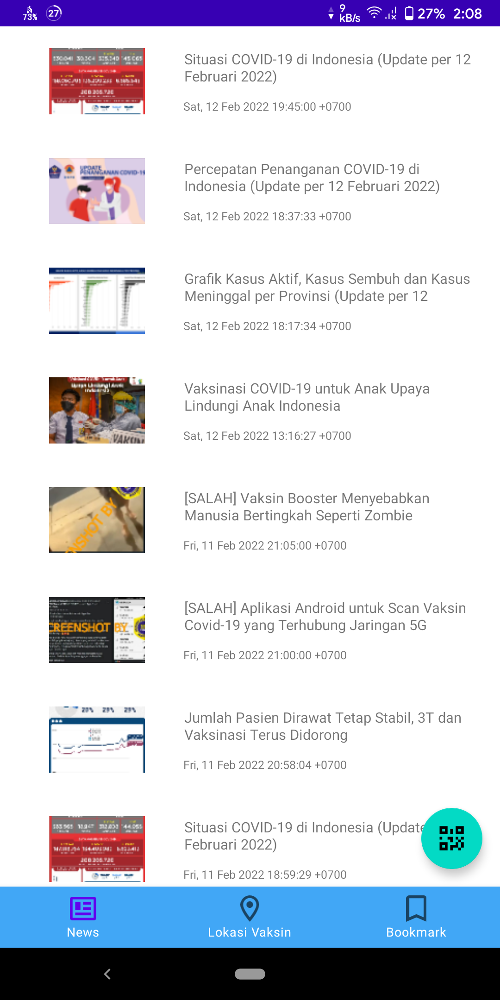
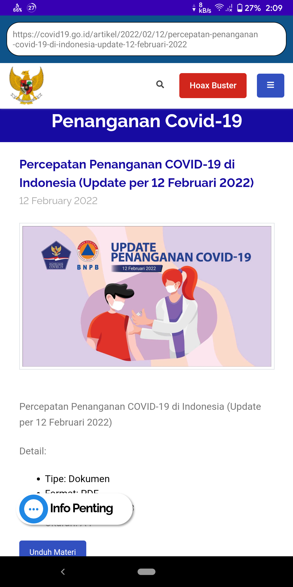
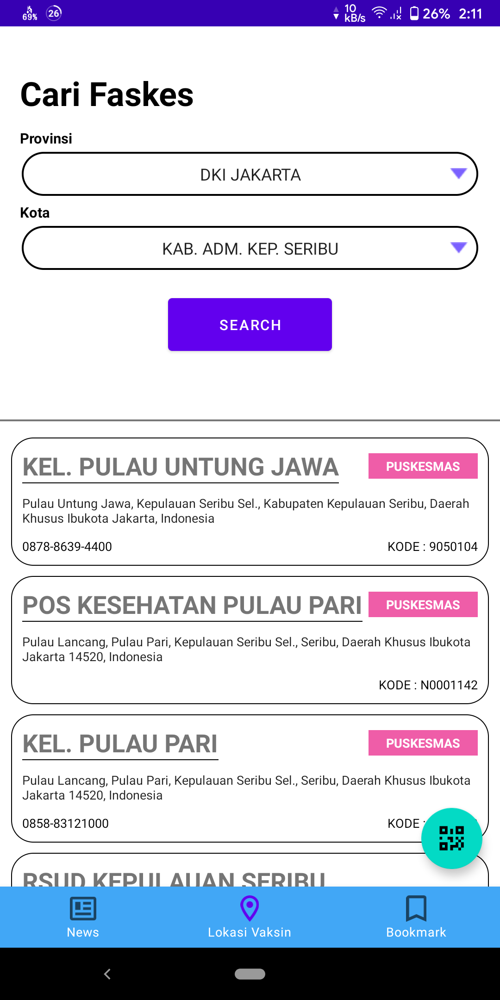
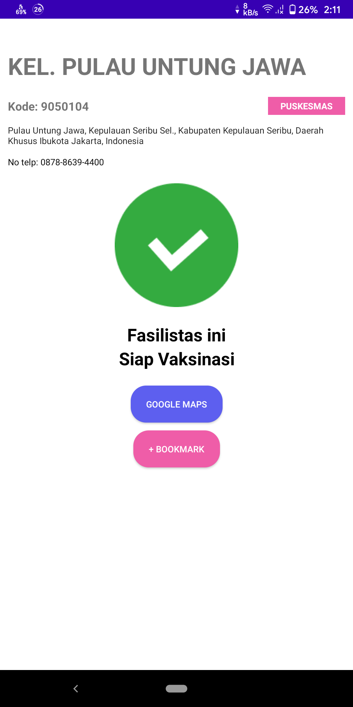
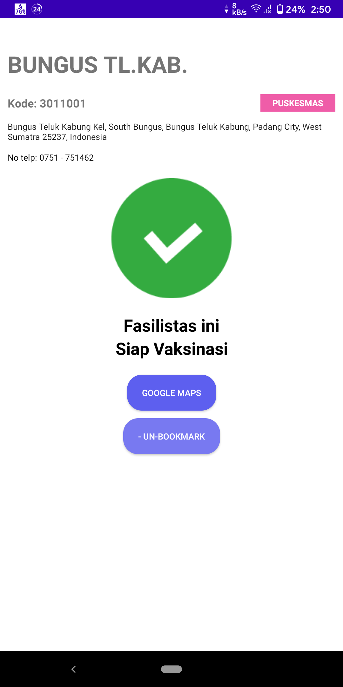

# IF3210-2022-Android-01

## Deskripsi aplikasi

Aplikasi bernama Perlu Dilindungi. Berikut fitur-fitur yang ada pada aplikasi ini.

1. Menampilkan Berita COVID-19  
   Pengguna dapat melihat berita COVID-19. Terdapat halaman untuk menampilkan list berita dan setiap berita dapat dibuka dengan cara mengkliknya, aplikasi akan menampilkan berita dalam bentuk webview.

2. Menampilkan Informasi Faskes untuk Vaksinasi  
   Pengguna dapat mencari tempat vaksinasi terdekat. Pengguna akan memilih provinsi dan kota lokasi faskes yang ingin dicari terlebih dahulu. Setelah itu, pengguna dapat menekan tombol search yang akan menampilkan lima faskes terdekat dari tempat pengguna. Untuk melihat detail dari faskes, pengguna dapat mengklik setiap item yang ada di dalam list, lalu aplikasi akan menampilkan detail dari faskes yang dipilih tersebut. Pada halaman detail faskes, terdapat tombol untuk memasukkan faskes ke bookmark tempat vaksinasi (dengan tombol yang sama pengguna juga dapat melakukan un-bookmark). Jika pengguna ingin melihat peta dari faskes tersebut, terdapat tombol yang bisa diklik, dan pengguna akan diteruskan ke aplikasi google maps.

3. Menampilkan Daftar Bookmark Faskes  
   Pengguna dapat menampilkan daftar bookmark faskes dalam bentuk list. Faskes yang di bookmark dapat ditekan yang kemudian akan membuka halaman detail dari faskes tersebut. Halaman detail ini sama dengan halaman yang di atas.

4. Melakukan "Check-In"  
   Pengguna dapat menggunakan halaman QR Code Scanner bawaan aplikasi untuk melakukan check in. String yang diperoleh dari QR Code beserta dengan informasi latitude dan longitude pengguna akan dikirimkan ke server Perlu Dilindungi yang dapat diakses.

## Cara kerja, terutama mengenai pemenuhan spesifikasi aplikasi.

1. Search Faskes  
   Ketika pengguna membuka halaman ini, aplikasi akan langsung merequest list provinsi dari API, setelah itu pengguna dapat memilih provinsinya. Ketika pengguna sudah memilih provinsi, server akan me-request kota.

## Library yang digunakan dan justifikasi penggunaannya

**Untuk mengirimkan request ke server**  
implementation 'com.squareup.retrofit2:retrofit:2.3.0'
implementation 'com.squareup.retrofit2:converter-gson:2.3.0'

**Untuk mengakses lokasi pengguna**  
implementation 'com.google.android.gms:play-services-location:19.0.1'

**Untuk menggunakan fragment**  
implementation 'androidx.fragment:fragment-ktx:1.4.1'  
implementation 'com.android.support:multidex:1.0.3'

**Untuk menggunakan ViewModel**  
implementation 'androidx.lifecycle:lifecycle-viewmodel-ktx:2.4.1'

**Untuk menggunakan LiveData di ViewModel**  
implementation 'androidx.lifecycle:lifecycle-livedata-ktx:2.4.1'

**Untuk mengakses database sqlite dan sebagai ORM**  
implementation "androidx.room:room-runtime:2.4.2"  
kapt "androidx.room:room-compiler:2.4.2"

**Untuk menjalankan program secara async untuk database**  
implementation "androidx.room:room-ktx:2.4.2"  
implementation "org.jetbrains.kotlinx:kotlinx-coroutines-core:1.5.2"

**Untuk menampilkan image pada ImageView**  
implementation "com.squareup.picasso:picasso:2.71828"

## Screenshot aplikasi (dimasukkan dalam folder screenshot).

-   Halaman List Berita
    

-   Halaman Detail Berita
    

-   Halaman List Faskes
    

-   Halaman Detail Faskes dengan Tombol Bookmark
    

-   Halaman Detail Faskes dengan Tombol Un-Bookmark
    

## Pembagian kerja anggota kelompok.

1. List Berita (Andrew)
2. Detail Berita (Andrew)
3. Cari Faskes (Yudi)
4. Detail Faskes (Yudi)
5. List Bookmark (Jose)
6. Halaman QR-Code Scanner (Jose)

## Anggota

1. 13519022 - Jose Galbraith Hasintongan
2. 13519036 - Andrew
3. 13519051 - Yudi Alfayat
